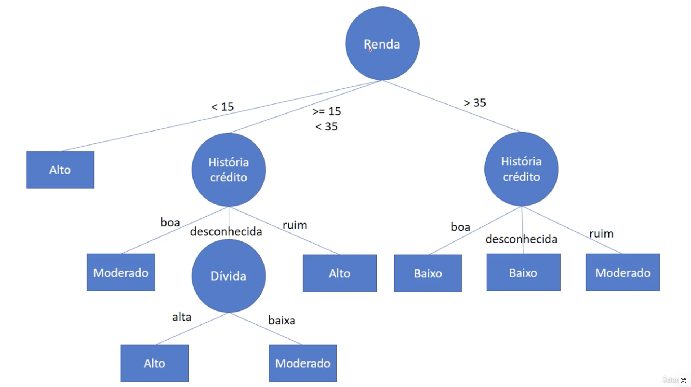
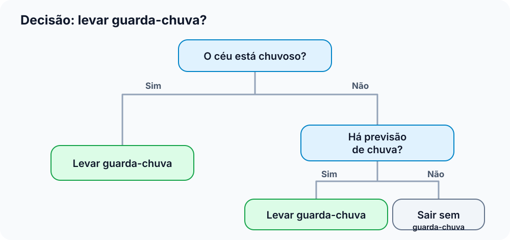
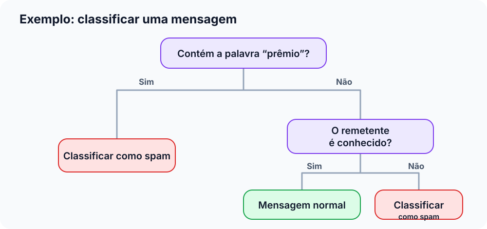

# Árvores de decisão

Exemplo para ver o risco de empréstimo para uma pessoa

Uma **árvore de decisão** é um jeito de tomar uma decisão passando por uma sequência de perguntas. Cada resposta leva a uma nova pergunta ou a uma conclusão. O formato lembra uma árvore de cabeça para baixo: começa em um ponto no alto e vai se dividindo em caminhos até chegar ao resultado.

Você provavelmente já usou esse raciocínio sem perceber. Imagine decidir se vai levar um guarda-chuva:

Cada pergunta separa as possibilidades em grupos menores. Quando chegamos a uma resposta final, não precisamos continuar perguntando.

## Como isso é usado em aprendizado de máquina?

No aprendizado de máquina, uma árvore de decisão aprende essas perguntas a partir de exemplos. Em vez de alguém escrever todas as regras manualmente, mostramos dados para o computador e informamos o resultado correto de cada exemplo. O modelo procura perguntas que ajudem a separar os exemplos de acordo com seus resultados.

Por exemplo, para prever se uma pessoa vai gostar de determinado filme, poderíamos fornecer exemplos com informações como gênero do filme, duração e avaliação, além de indicar se cada pessoa gostou ou não. A árvore poderia aprender perguntas como “A avaliação é maior que 7?” e usar as respostas para chegar a uma previsão.

As informações usadas nas perguntas são chamadas de **características** (ou *features*). O resultado que queremos prever é chamado de **alvo** (ou *target*).

## As partes da árvore

- **Raiz:** a primeira pergunta, no começo da árvore.
- **Nó:** um ponto em que a árvore faz uma pergunta ou regra.
- **Ramo:** um caminho escolhido de acordo com a resposta, como “sim” ou “não”.
- **Folha:** o ponto final de um caminho, onde a árvore apresenta sua previsão.

Uma previsão é feita começando na raiz e seguindo os ramos conforme as respostas sobre o exemplo. Ao chegar a uma folha, a previsão está pronta.

## O que uma folha pode prever?

Árvores podem resolver dois tipos comuns de problema:

1. **Classificação:** escolher uma categoria. Exemplos: dizer se um e-mail é *spam* ou *não spam*, ou se uma imagem mostra um gato ou um cachorro.
2. **Regressão:** prever um número. Exemplos: estimar o preço de uma casa ou a temperatura de amanhã.

A estrutura da árvore é parecida nos dois casos. O que muda é o tipo de resposta guardado nas folhas: uma categoria na classificação e um valor numérico na regressão.

## Como a árvore aprende as perguntas?

Durante o treinamento, o algoritmo avalia várias perguntas possíveis e escolhe aquelas que separam melhor os exemplos. Uma boa pergunta tende a deixar cada grupo mais organizado. Por exemplo, se quase todos os exemplos de um grupo pertencem à mesma categoria, fica mais fácil fazer uma previsão para esse grupo.

O algoritmo repete esse processo nos grupos criados: escolhe outra pergunta, divide os exemplos e continua até atingir um critério de parada. Dependendo do algoritmo e do problema, a qualidade de uma divisão pode ser medida por critérios como **impureza de Gini**, **entropia** ou erro quadrático. Não é necessário decorar esses nomes agora: todos ajudam o algoritmo a comparar divisões e preferir as que tornam os grupos mais úteis para prever.

## Um exemplo de classificação

Suponha que temos exemplos de mensagens marcadas como “spam” ou “normal”. A árvore poderia aprender algo parecido com isto:

Essa árvore é apenas uma ilustração. Na prática, uma árvore treinada pode ter muitas perguntas, e uma única palavra raramente seria suficiente para decidir com certeza. O modelo combina padrões que encontra nos exemplos; ele não entende a mensagem como uma pessoa entende.

## Um cuidado importante: decorar os exemplos

Se deixarmos a árvore crescer sem limite, ela pode criar uma regra específica para quase cada exemplo de treinamento. Nesse caso, ela pode acertar muito os dados que já viu, mas errar exemplos novos. Isso se chama **sobreajuste** (ou *overfitting*): o modelo aprende detalhes e exceções dos exemplos antigos em vez de capturar padrões que se repetem.

Para reduzir esse risco, podemos limitar o crescimento da árvore. Algumas opções comuns são:

- **Profundidade máxima:** limita quantas perguntas podem existir em sequência.
- **Mínimo de exemplos para dividir um nó:** evita criar uma nova divisão com pouquíssimos exemplos.
- **Mínimo de exemplos por folha:** evita que uma previsão final dependa de um grupo muito pequeno.

Esses limites ajudam a árvore a encontrar um equilíbrio: detalhada o bastante para aprender padrões, mas sem ficar tão específica que só funcione nos exemplos usados para treiná-la.

## Vantagens e limitações

**Vantagens**

- É possível acompanhar as perguntas e entender como o modelo chegou a uma previsão.
- Lida com dados de tipos diferentes, como categorias e números.
- É fácil de explicar quando a árvore tem poucas perguntas.

**Limitações**

- Uma árvore muito grande pode ficar difícil de entender.
- Árvores profundas podem se ajustar demais aos exemplos de treinamento.
- Pequenas mudanças nos dados podem produzir uma árvore diferente.
- Uma árvore sozinha nem sempre prevê tão bem quanto métodos que combinam várias árvores.

## Para guardar

Pense em uma árvore de decisão como um **fluxograma que aprende com exemplos**. Ela faz perguntas sobre as características dos dados, segue os caminhos correspondentes às respostas e termina com uma previsão. É útil por ser relativamente fácil de visualizar e explicar, mas precisa ser controlada para não ficar complexa demais e perder a capacidade de funcionar bem com casos novos.
